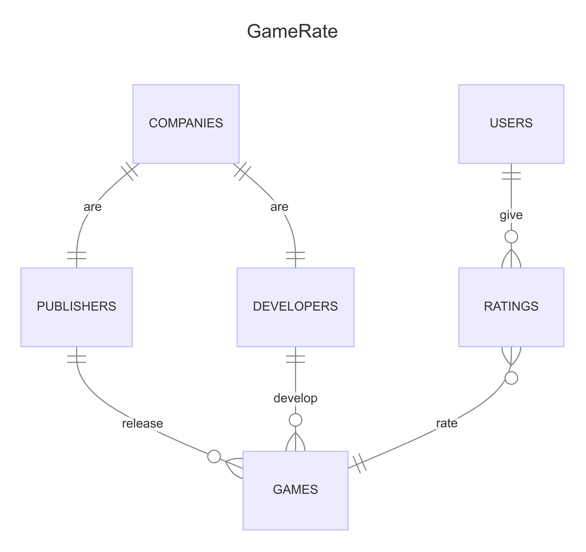

# Design Document

By Kamil Rasiński

Video overview: https://youtu.be/bN-MyplZElA

## Scope

This database allows storing basic information about games, their developers and publishers, and also collects ratings given to these games by users of the database. The scope of the database includes:

* Games, including basic identification data;
* Companies, including companies that that are involved in the process of releasing the game on the market i.e. developers and publishers;
* Developers, including companies that make the games;
* Publishers, including companies that release games made by developers;
* Users, that can give rating to particular games;
* Rating, including ratings given by users to particular games.

Out of scope are elements like more detailed data on games and companies e.g. the number of players, the cost of the game, the size of the company.

## Functional Requirements

This database will support:

* CRUD operations for users and database administrators.
* Tracking ratings given by users to individual games and view the average rating given by users to each game.

In this iteration, the system will not support adding reviews to games.

## Representation

Entities are captured in SQLite tables and views with the following schema.

### Entities

The database includes following entities:

#### TABLES

The `games` table includes:
* `id`, which specifies the unique ID for the game as an `INTEGER`. This column thus has the `PRIMARY KEY` constraint applied.
* `title`, which specifies the title of the game as an `TEXT`, given `TEXT` is appropriate for title fields.
* `developer_id`, which is the ID of the developer who made the game as an `INTEGER`. This column thus has the `FOREIGN KEY` constraint applied, referencing the `id` column in the `companies` table to ensure data integrity.
* `publisher_id`, which is the ID of the publisher who released the game as an `INTEGER`. This column thus has the `FOREIGN KEY` constraint applied, referencing the `id` column in the `companies` table to ensure data integrity.
* `year`, which specifies in which year the game was published as an `NUMERIC`.
* `type`, which specifies the type of game as an `TEXT`.

The `companies` table includes:
* `id`, which specifies the unique ID for the company as an `INTEGER`. The company is either developer or publisher. This column thus has the `PRIMARY KEY` constraint applied.
* `name`, which specifies the name of the company as an `TEXT`, given `TEXT` is appropriate for name fields.
* `country`, which specifies which country the company comes from as an `TEXT`.

The `developers` table includes:
* `id`, which specifies the unique ID for the developer company as an `INTEGER`. This column thus has the `PRIMARY KEY` constraint applied.
* `company_id`, which is the ID of the developer company in the `companies` table as an `INTEGER`. This column has the `FOREIGN KEY` constraint applied, referencing the `id` column in the `companies` table to ensure data integrity.

The `publishers` table includes:
* `id`, which specifies the unique ID for the publisher company as an `INTEGER`. This column thus has the `PRIMARY KEY` constraint applied.
* `company_id`, which is the ID of the publisher company in the `companies` table as an `INTEGER`. This column has the `FOREIGN KEY` constraint applied, referencing the `id` column in the `companies` table to ensure data integrity.

The `users` table includes:
* `id`, which specifies the unique ID for the user as an `INTEGER`. This column thus has the `PRIMARY KEY` constraint applied.
* `first_name`, which specifies the users's first name as `TEXT`, given `TEXT` is appropriate for name fields.
* `last_name`, which specifies the users's last name. `TEXT` is appropriate for name fields.
* `username`, which specifies the user's username. `TEXT` is appropriate for name fields. A `UNIQUE` constraint ensures no two users have the same username.
* `password`, which specifies the user's password. `TEXT` is appropriate for password fields.

The `ratings` table includes:
* `id` , which specifies the unique ID for the rating as an `INTEGER`. This columns thus has the `PRIMARY KEY` constraint applied.
* `user_id`, which is the ID of the user in the `users` table as an `INTEGER`. This column has the `FOREIGN KEY` constraint applied, referencing the `id` column in the `users` table to ensure data integrity.
* `game_id`, which is the ID of the game in the `games` table as an `INTEGER`. This column has the `FOREIGN KEY` constraint applied, referencing the `id` column in the `games` table to ensure data integrity.
* `rating`, which is the rating that user have given to a particular game as an `NUMERIC`. The `CHECK` constraint is to ensure that the rating is only between 1 and 10, so users cannot add ratings below and above this range.
* `one_rating_per_user` constraint is to ensure that one user can rate one particular game only once.

### Relationships

The below entity relationship diagram describes the relationships among the entities in the database.

As detailed by the diagram:

* One and only one company can be one and only one publisher and one and only one developer at the same time. Companies can be publishers and developers at the same time, but they can also be only a publisher or only a developer.
* Developer is capable of making 0 to many games. The game may be in development by a currently existing company, but not yet developed. Developers can make multiple games. It is assumed that developer companies will made games individually as company.
* Publisher is capable of release 0 to many games. The game may not be released yet, but is planned for release by a currently existing company. Publishers can release multiple games. It is assumed that publisher companies will release games individually as company.
* Game can be developed by one and only one developer and released by one and only one publisher. One game can be rated 0 to many times.
* Individual rating can be given to one and only one game.  A rating must rate a game to exist, so there cannot be a rating that does not rate a game.
* Users can give 0 to many ratings to games. One particular rating can be made by one and only one user. Users don't have to give ratings to games.

## Optimizations

In the database, indexes have been created on the columns `title` in the table `games`, `name` in the table `companies` and `username` in the table `users`. These indexes are designed to optimize searches in this database by enabling faster searches through the use of unique names, which is the main information that allows identifying a row of data.

The database includes several views that allow users and administrators to view the data in a clearer way, making it more accessible and easier to avoid mistakes in CRUD activities.

The `games_made_by` view selects:
* `title` from `games` table,
* `name` from `developers` table,
* `name` from `publishers` table
The aforementioned columns joined together provide a quick overview of developers and publishers of specific game titles.

The `developers_view` view selects:
* `id` from `developers` table,
* `name` from `companies` table,
The aforementioned columns joined together provide a quick overview of developers id's in developers table.

The `publishers_view` view selects:
* `id` from `publishers` table,
* `name` from `companies` table,
The aforementioned columns joined together provide a quick overview of publishers id's publishers table.

The `games_rating` view selects:
* `title` from `games` table,
* `rating` from `ratings` table, which is the average (`AVG`) of all ratings for each game (by use of `GROUP BY`) and rounded to 2 digits after the decimal (`ROUND` (2)).
The above view allows you to extract the average ratings of all users for a given game.

The `users_ratings` view selects:
* `title` from `games` table,
* `username` from `users` table,
* `rating` from `ratings` table,
The above view allows you to extract ratings for specific games by specific users

## Limitations

This database does not foresee a situation where one game would be developed or published by more than one developer or publisher.
Additionally, the data is broken into multiple tables, which may not be fully transparent in every situation (hence the views, which make the database more transparent).
